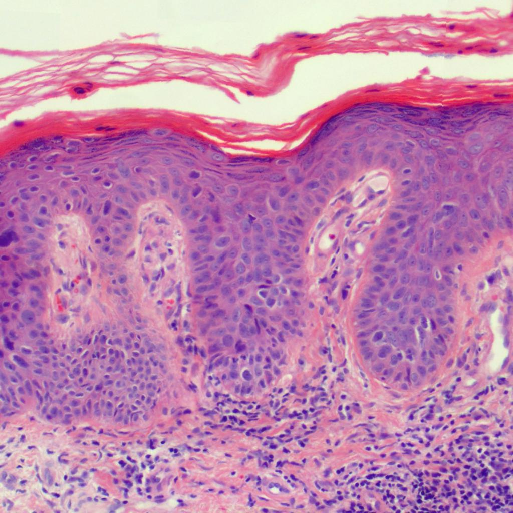

# Representation Learning for Non-Melanoma Skin Cancer using a Latent Autoencoder

<figure>
  
  <figcaption align="center">
    <i>The upper layer shows fragmented basket weave keratosis with focal parakeratosis. The epidermis shows severe dysplasia. The dermis shows inflammation.</i>
  </figcaption>
</figure>

<br>


Repository to accompany the [paper](https://arxiv.org/abs/2209.01779).

```
@article{thomas2022representation,
  title={Representation Learning for Non-Melanoma Skin Cancer using a Latent Autoencoder},
  author={Thomas, Simon Myles},
  journal={arXiv preprint arXiv:2209.01779},
  year={2022}
}
```


Visit https://smthomas-sci.github.io/RepresentationLearningNon-Melanoma/ to see an interactive paper 
which explores further the possibilties for representation learning for computational pathology. 

**Note: Code and Data planned for release**.


<hr>

# Training Curves

The below graphs are an indication of the training stability of adversarial training conditioned on a pre-trained (spatial) autoencoder.

## Intraepidermal Carcinoma


## MNIST

Trained firstly as `encoder` and `decoder`, and then converted to `alae` model. Smooth adversarial training and fast convergence.


